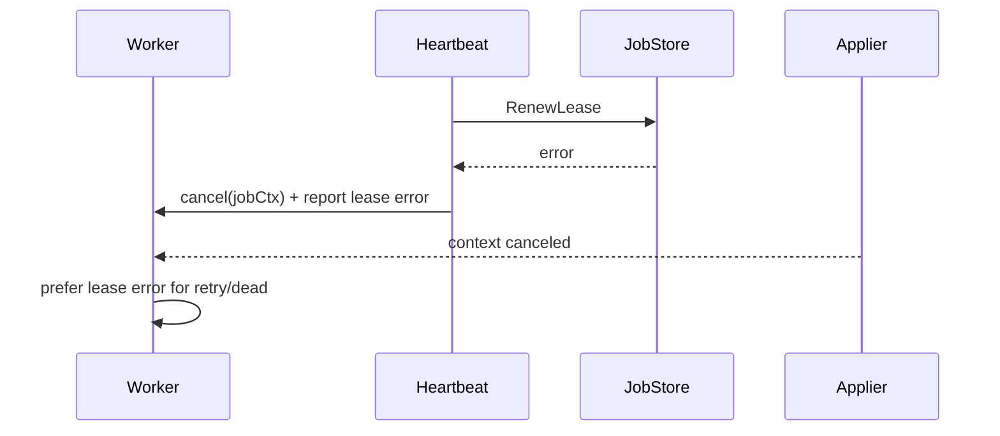

# DeltaFlow Design

> Status: v0.4 design.
>
> Goal: keep DeltaFlow small, explicit, and clear.
>
> DeltaFlow v0.4 is a latest-state synchronization worker with in-memory and durable Delta and SyncJob stores.
> In v0.2, a Sync is not a graph, not a connector registry, not a multi-target fan-out system, and not an Apache Beam pipeline.


---

## 1. Goal

DeltaFlow v0.4 helps an application keep one derived system synchronized with the latest state of a business Projection.

This version answers one question:

```text
Something changed. Can DeltaFlow project the latest business state and apply it safely?
```

This version is intentionally small:

```text
one Sync
one Projector
one ProjectionApplier
latest_state mode only
in-memory DeltaStore + JobStore + DispatchStore (non-durable)
worker leases
retries
dead SyncJobs
Delta Ghost handling
```

---

## 2. Non-goals for v0.4

DeltaFlow v0.4 does not include:

```text
CDC as the primary abstraction
multiple appliers per Sync
fan-out
target deliveries
connector registry
dynamic plugins
captured_input
captured_output
envelopes
codecs
Avro
Protobuf
Apache Beam
cloud control plane
billing
dashboard
non-idempotent effect targets
```

---

## 3. Core Vocabulary

### 3.1 Projection

A Projection is the business object or business representation that DeltaFlow synchronizes.

A Projection is not necessarily a database row. It may be built from one table, many tables, joins, external data, or business rules.

Examples:

```text
Contact
Order
EmployeeProfile
Invoice
Document
```

A Projection is the thing DeltaFlow wants to keep synchronized in a derived system.

---

### 3.2 Projection Type

A Projection Type is a string that classifies a Projection.

It acts as a classifier or typer.

Examples:

```text
"Contact"
"Order"
"EmployeeProfile"
"Invoice"
"Document"
```

In Go:

```go
type ProjectionType string
```

A Projection Type is logical. It should not be assumed to be a database table name.

Example:

```text
Projection Type: "Contact"
```

A `Contact` Projection may be built from:

```text
contacts
contact_emails
contact_phones
contact_addresses
contact_tags
```

---

### 3.3 Projection Key

A Projection Key identifies one Projection instance.

The key may be a single-field key or a structured composite key.

Examples:

```json
{ "contact_id": "123" }
```

```json
{
  "order_id": "ord_123",
  "line_number": 2
}
```

```json
{
  "tenant_id": "t_001",
  "user_id": "usr_999"
}
```

DeltaFlow treats Projection Keys as structured data, not as a single string-only identifier.

For storage and uniqueness, DeltaFlow computes a stable hash:

```text
projection_key_hash = sha256(canonical_json(projection_key))
```

Equivalent keys must produce the same hash regardless of field order.

---

### 3.4 Projection Identity

A Projection Identity names one Projection instance.

It is composed of:

```text
projection_type
projection_key
```

Example:

```text
projection_type = "Contact"
projection_key  = { "contact_id": "123" }
```

A Projection Identity answers:

```text
Which Projection instance are we talking about?
```

It does not answer:

```text
How do we build it?
Where do we apply it?
Which worker should process it?
Which retry policy applies?
```

Those concerns belong to the Sync and the worker wiring.

---

### 3.5 Projector

A Projector is user-provided code that obtains or builds a Projection.

A Projector may be an object, function, or interface.

A Projector answers:

```text
How do we get the latest Projection for this Projection Identity?
```

The verb is:

```text
Project
```

In v0.4, the Projector always projects the latest state.

Minimal interface:

```go
type Projector interface {
    Project(ctx context.Context, identity ProjectionIdentity) (Projection, error)
}
```

If the Projection no longer exists, the Projector returns:

```go
ErrProjectionNotFound
```

That case is called a **Delta Ghost**.

---

### 3.6 Projection Operation

A Projection Operation is the operation that the worker asks a ProjectionApplier to apply.

For v0.4, only two operations exist:

```text
upsert
delete
```

The worker decides the operation after asking the Projector for the latest Projection.

If the Projector returns a Projection:

```text
operation = upsert
```

If the Projector returns `ErrProjectionNotFound`:

```text
operation = delete
```

Go shape:

```go
type ProjectionOperationType string

const (
    ProjectionOpUpsert ProjectionOperationType = "upsert"
    ProjectionOpDelete ProjectionOperationType = "delete"
)

type ProjectionOperation struct {
    Type       ProjectionOperationType
    Identity   ProjectionIdentity
    Projection *Projection
}
```

For `delete`, `Projection` is nil.

---

### 3.7 ProjectionApplier

A ProjectionApplier is user-provided code that applies a Projection Operation to a derived system.

A ProjectionApplier is not the target system itself.

Example:

```text
Elasticsearch is the derived system.
ElasticsearchProjectionApplier is the code that applies operations to Elasticsearch.
```

Minimal interface:

```go
type ProjectionApplier interface {
    Apply(ctx context.Context, op ProjectionOperation) error
}
```

For v0.4, ProjectionAppliers are assumed to be idempotent.

That means:

```text
Apply upsert twice = safe
Apply delete twice = safe
Apply delete when missing = safe
```

Examples of v0.4-friendly derived systems:

```text
Elasticsearch document
Redis key
Postgres read model row
RAG chunks keyed by Projection Identity
```

---

### 3.8 Delta

A Delta is a signal that a Projection Identity changed and must be synchronized.

A Delta is not a historical domain event.

It does not promise to describe exactly what happened.

It means:

```text
This Projection Identity became dirty. Project its latest state and apply it.
```

Example Delta:

```json
{
  "sync_id": "contacts-to-elasticsearch",
  "projection_type": "Contact",
  "projection_key": {
    "contact_id": "123"
  }
}
```

A Delta does not mean:

```text
Contact 123 was inserted.
Contact 123 was updated.
Contact 123 was deleted.
```

It means:

```text
Synchronize the latest state of Contact 123.
```

Important: Outbox SyncJobs are created from Deltas.

v0.4 also allows direct SyncJob creation for operational workflows.
When `origin = outbox`, `delta_id` should reference the source Delta.
When `origin = backfill`, `origin = replay`, or `origin = manual`, `delta_id` may be empty.

Examples:
App transaction -> creates Delta
Dispatcher -> creates outbox SyncJob from Delta
Backfill/replay/manual -> can create SyncJob directly
Manual retry -> reactivates an existing SyncJob, or creates one when needed
Worker -> processes SyncJob

---

### 3.9 Delta Outbox

The Delta Outbox is the planned durable database table where the application stores Deltas.

In v0.4, DeltaFlow supports two store implementations—(a) an in-memory store and (b) a Postgres durable store—while keeping the same conceptual contract.

The application should insert a Delta in the same transaction as the business data change.

Example:

```sql
BEGIN;

UPDATE contacts
SET name = 'Leo'
WHERE id = '123';

INSERT INTO deltaflow_deltas (
    sync_id,
    projection_type,
    projection_key,
    projection_key_hash,
    state
)
VALUES (
    'contacts-to-elasticsearch',
    'Contact',
    '{"contact_id":"123"}',
    'sha256...',
    'pending'
);

COMMIT;
```

This is the outbox pattern.

The important rule:

```text
business write + Delta insert commit together
```

If the transaction rolls back, the Delta rolls back too.

---

### 3.10 Sync


It connects:

```text
one Projector
one ProjectionApplier
one Projection Type
```

A Sync answers:

```text
How should this kind of Projection be synchronized?
```

Example:

```text
sync_id = contacts-to-elasticsearch
projection_type = Contact
projector = ContactProjector
applier = ElasticsearchProjectionApplier
```

It is a small source-to-derived-system synchronization route.

---

### 3.11 SyncWorker

A SyncWorker is the runtime process that claims Deltas and executes a Sync.

A SyncWorker:

```text
claims pending Deltas
calls Projector.Project(identity)
creates a ProjectionOperation
calls ProjectionApplier.Apply(operation)
records success or failure
schedules retries
marks Deltas dead after retry exhaustion
```

The SyncWorker should be boring.

Boring ships.

Lease renewal failure behavior (short version):



If lease renewal fails, the worker cancels in-flight work immediately so it
does not continue without ownership. If `Apply` returns `context.Canceled`
because of that cancellation, the worker records the lease renewal error as the
real failure cause. The same precedence applies when `Project` returns early
with `context.Canceled` after heartbeat-triggered cancellation.

---

### 3.12 Delta Ghost

A Delta Ghost is a Projection Identity that produced a Delta but no longer exists when latest-state synchronization runs.

Example:

```text
Contact / 1
insert -> update -> update -> delete
```

When the SyncWorker finally runs:

```text
Projector.Project(Contact, { "contact_id": "1" }) -> ErrProjectionNotFound
```

This is not an error.

In `latest_state` mode, the correct operation is usually:

```text
ProjectionOperation = delete
```

A Delta Ghost is a valid synchronization outcome.

---

## 4. Naming Convention

DeltaFlow uses projection-based terminology.

Preferred internal names:

```text
projection_type
projection_key
projection_key_hash
sync_id
delta
```

Avoid these names in the core model:

```text
entity_type
entity_id
event
target
source
connector
```

Reason:

```text
entity_id implies a single scalar identifier.
event implies historical replay.
target confuses the external system with the code that applies operations.
source is too generic for the Projector role.
connector implies plugin/registry architecture.
```

Example:

```text
entity = Contact
id = 123
```

Should be represented internally as:

```json
{
  "projection_type": "Contact",
  "projection_key": {
    "contact_id": "123"
  }
}
```

---

## 5. DeltaFlow current state

```text
Application transaction
  1. write business data
  2. insert Delta into Delta Outbox
  3. commit

Dispatcher
    4. read pending Deltas
    5. create SyncJobs for claimable Deltas
    6. mark mapped Deltas as dispatched

SyncWorker
    7. claim pending SyncJob
    8. call Projector.Project(identity)
    9. if Projection exists:
         create upsert operation
     if Projection does not exist:
         create delete operation
    10. call ProjectionApplier.Apply(operation)
    11. mark SyncJob synced, retrying, or dead
```

---

## 6. Delta and SyncJob States

DeltaFlow uses two explicit state models:

1. Delta lifecycle (outbox-facing)
2. SyncJob lifecycle (worker-facing)

Delta states:

```text
pending
dispatched
ignored
```

Definitions:

```text
pending
    Delta exists in the outbox and has not been mapped to a SyncJob.

dispatched
    Delta has been mapped to a SyncJob.

ignored
    Delta was intentionally skipped by the dispatch path.
```

SyncJob states:

```text
pending
processing
synced
retrying
dead
```

Definitions:

```text
pending
    SyncJob exists and is available to be claimed.

processing
    A SyncWorker has claimed the SyncJob.

synced
  The ProjectionApplier successfully applied the required operation.

retrying
    The last attempt failed and the SyncJob is waiting for a future retry.

dead
    The SyncJob exhausted retries or was manually marked dead.
```

A failed attempt is not a separate stored state in DeltaFlow. The worker records the
error details and moves the SyncJob directly to `retrying` when another attempt
is available, or to `dead` when retries are exhausted.

No TargetDelivery state model exists in current version.

The Delta and SyncJob state models are intentionally separate.

---

## 7. Database Table

The domain model is split into two concerns:

1. outbox table
2. jobs table

The outbox table records application-side change signals in the same transaction
as business writes.

In the Postgres implementation, application code should execute its business
write and Delta insert inside the same `*sql.Tx`. The concrete
`postgres.DeltaStore` exposes `EnqueueInTx(ctx, tx, delta)` for this path,
while regular `Enqueue(ctx, delta)` remains available for non-transactional
operational inserts.

The jobs table is worker-facing and tracks claim/lease/retry/dead state for
execution.

Required behavior:

```text
- business write + outbox insert are atomic
- jobs are claimable with lease semantics
- retries and dead handling are explicit
- latest-state dedupe is supported by stable projection identity
```

Example transactional write path:

```go
tx, err := db.BeginTx(ctx, nil)
if err != nil {
    return err
}
defer tx.Rollback()

if _, err := tx.ExecContext(ctx, `INSERT INTO app_contacts (id, name) VALUES ($1, $2)`, id, name); err != nil {
    return err
}

if _, err := deltaStore.EnqueueInTx(ctx, tx, deltaflow.Delta{
    SyncID:         syncID,
    Origin:         deltaflow.OriginOperationUpdated,
    ProjectionType: "Contact",
    ProjectionKey:  deltaflow.ProjectionKey{"contact_id": json.RawMessage(strconv.Quote(id))},
}); err != nil {
    return err
}

return tx.Commit()
```

In current version, these concerns are represented by in-memory and durable stores.

Detailed SQL schema, indexes, and migration shape are deferred to a persistence milestone.

---

## 8. Minimal Go Interfaces

Interface boundary rule:

- Keep `pkg/deltaflow` interfaces transport-agnostic and focused on domain workflow.
- Do not add queue/ack dispatcher semantics (broker handles, ack/nack contracts, delivery tokens) to the public interfaces.
- Introduce queue-specific behavior only in connector packages (for example, Postgres, Kafka, SQS, NATS) through concrete extension methods.
- This preserves a stable core API while allowing future dispatcher implementations to evolve independently.

```go
type ProjectionType string

type ProjectionKey map[string]json.RawMessage

type ProjectionIdentity struct {
    Type ProjectionType
    Key  ProjectionKey
}

type Projection struct {
    Identity  ProjectionIdentity
    Payload   []byte
    MediaType string
    Checksum  string
}

type Projector interface {
    Project(ctx context.Context, identity ProjectionIdentity) (Projection, error)
}

type ProjectionOperationType string

const (
    ProjectionOpUpsert ProjectionOperationType = "upsert"
    ProjectionOpDelete ProjectionOperationType = "delete"
)

type ProjectionOperation struct {
    Type       ProjectionOperationType
    Identity   ProjectionIdentity
    Projection *Projection
}

type ProjectionApplier interface {
    Apply(ctx context.Context, op ProjectionOperation) error
}

var (
    ErrProjectionNotFound = errors.New("projection not found")
    ErrDeltaNotFound      = errors.New("delta not found")
    ErrJobNotFound        = errors.New("job not found")
    ErrInvalidLockFor     = errors.New("lock duration must be positive")
    ErrDeltaIDProvided    = errors.New("delta id must be empty")
    ErrOutboxJobNeedsDelta = errors.New("outbox job requires delta id")
    ErrJobIDProvided      = errors.New("job id must be empty")
    ErrDeltaAlreadyMapped = errors.New("delta already mapped to job")
)

These sentinels represent store-contract violations and common workflow
branches. Callers should rely on them for precondition failures, not-found
mutations, and outbox delta-to-job mapping conflicts.

type DeltaStore interface {
    Enqueue(ctx context.Context, delta Delta) (*Delta, error)

    Get(ctx context.Context, deltaID DeltaID) (*Delta, bool, error)

    Pull(ctx context.Context, syncID SyncID, limit int) ([]*Delta, error)

    MarkDispatched(ctx context.Context, deltaID DeltaID) error
}

type JobStore interface {
    Create(ctx context.Context, job SyncJob) (*SyncJob, error)

    Get(ctx context.Context, jobID SyncJobID) (*SyncJob, bool, error)

    ClaimNext(ctx context.Context, syncID SyncID, workerID string, lockFor time.Duration) (*SyncJob, error)

    MarkSynced(ctx context.Context, jobID SyncJobID, ghostDetected bool) error

    MarkRetrying(ctx context.Context, jobID SyncJobID, err error, nextRunAt time.Time) error

    MarkDead(ctx context.Context, jobID SyncJobID, err error) error
}

type DispatchStore interface {
    DispatchPending(ctx context.Context, syncID SyncID, limit int) ([]*SyncJob, error)
}
```

`ClaimNext` requires a positive `lockFor` duration. JobStore
implementations should return `ErrInvalidLockFor` without claiming a SyncJob when
`lockFor <= 0`.

`Enqueue` requires `delta.ID` to be empty. DeltaStore implementations should
return `ErrDeltaIDProvided` when callers provide a non-empty ID, because the
store owns Delta primary key assignment.

`Create` requires `job.ID` to be empty. JobStore implementations should return
`ErrJobIDProvided` when callers provide a non-empty ID, because the store owns
SyncJob primary key assignment.

`Create` should return `ErrOutboxJobNeedsDelta` when `job.Origin == JobOriginOutbox`
and `job.DeltaID` is empty.

`MarkSynced`, `MarkRetrying`, and `MarkDead` should return `ErrJobNotFound`
when the requested SyncJob does not exist.

Function adapters may also be provided:

```go
type ProjectorFunc func(context.Context, ProjectionIdentity) (Projection, error)

func (f ProjectorFunc) Project(ctx context.Context, id ProjectionIdentity) (Projection, error) {
    return f(ctx, id)
}

type ProjectionApplierFunc func(context.Context, ProjectionOperation) error

func (f ProjectionApplierFunc) Apply(ctx context.Context, op ProjectionOperation) error {
    return f(ctx, op)
}
```

This allows users to provide either structs or simple functions.

---

## 9. SyncWorker Logic

Pseudo-code for a run-scoped worker:

```go
if _, err := dispatcher.DispatchPending(ctx, syncID, pullSize); err != nil {
    return err
}

job, err := jobStore.ClaimNext(ctx, syncID, workerID, lockFor)
if err != nil {
    return err
}

if job == nil {
    return nil
}

identity := ProjectionIdentity{
    Type: job.ProjectionType,
    Key:  job.ProjectionKey,
}

projection, err := projector.Project(ctx, identity)

switch {
case errors.Is(err, ErrProjectionNotFound):
    op := ProjectionOperation{
        Type:     ProjectionOpDelete,
        Identity: identity,
    }

    err = applier.Apply(ctx, op)
    if err != nil {
        return failOrRetry(ctx, jobStore, job, err)
    }

    return jobStore.MarkSynced(ctx, job.ID, true)

case err != nil:
    return failOrRetry(ctx, jobStore, job, err)

default:
    op := ProjectionOperation{
        Type:       ProjectionOpUpsert,
        Identity:   identity,
        Projection: &projection,
    }

    err = applier.Apply(ctx, op)
    if err != nil {
        return failOrRetry(ctx, jobStore, job, err)
    }

    return jobStore.MarkSynced(ctx, job.ID, false)
}
```

Retry/dead selection belongs in the worker, using the explicit `JobStore`
methods:

```go
func failOrRetry(ctx context.Context, store JobStore, job *SyncJob, err error) error {
    nextAttempt := job.AttemptCount + 1

    if nextAttempt >= job.MaxAttempts {
        return store.MarkDead(ctx, job.ID, err)
    }

    nextRunAt := time.Now().UTC().Add(backoff(nextAttempt))
    return store.MarkRetrying(ctx, job.ID, err, nextRunAt)
}
```

---

## 10. Retry Behavior

Retries should be simple.

Recommended defaults:

```text
max_attempts = 5
backoff = exponential
initial_delay = 5 seconds
max_delay = 5 minutes
```

A failed SyncJob should move to `retrying` if attempts remain.

A failed SyncJob should move to `dead` if attempts are exhausted.

```text
failed attempt + attempts remain -> retrying
failed attempt + no attempts left -> dead
```

### 10.1 Lease Semantics

DeltaFlow uses time-bound job leases for worker claims.

Baseline lease behavior (v0.3 scope):

```text
- claim acquires lease by setting state=processing, locked_by, locked_until
- claims use FOR UPDATE SKIP LOCKED to avoid double-claiming
- expired leases are reclaimable after locked_until
```

Lease hardening (v0.4 scope):

```text
- add explicit lease renewal/heartbeat API (`RenewLease` while processing)
- enforce lease ownership checks on MarkSynced/MarkRetrying/MarkDead using worker_id + active lease
- add tighter lease observability and operational controls
    - structured lease lifecycle logs via Go log/slog
    - low-cardinality lease counters/timers via telemetry interface (Prometheus-compatible)
    - operational visibility/actions for active, expired, and near-expiry leases
```

---

## 11. Minimal YAML

YAML is optional in the current version.

The app may wire Projector and ProjectionApplier directly in Go.

If YAML is used, keep it tiny:

```yaml
id: contacts-to-elasticsearch
mode: latest_state

projection_type: Contact

retry:
  max_attempts: 5
  backoff: exponential
  initial_delay: 5s
  max_delay: 5m
```

Do not put connector registry concepts in current version YAML.

No connector IDs.

No versions.

No digests.

No dynamic plugins.

Projector and ProjectionApplier construction belongs to application code in current version.

Example Go wiring:

```go
projector := deltaflow.ProjectorFunc(projectContact)
applier := deltaflow.ProjectionApplierFunc(applyContactToElasticsearch)

worker := SyncWorker{
    JobStore:   jobStore,
    Dispatcher: dispatchStore,
    Projector:  projector,
    Applier:    applier,
    WorkerID:   "worker-1",
    LockFor:    time.Minute,
    PullSize:   100,
}

_ = worker.RunOnce(ctx)
```

---

## 12. Logging Policy

Do not log Projection payloads by default.

Safe log fields:

```text
delta_id
sync_id
projection_type
projection_key_hash
state
attempt_count
duration
error_code
checksum
```

Unsafe by default:

```text
projection payload
raw source rows
secrets
derived system credentials
full customer data
```

---

## 13. Design Rules

1. current version supports only `latest_state`.
2. current version supports one Projector and one ProjectionApplier per SyncWorker configuration.
3. Do not implement a connector registry.
4. Do not implement fan-out.
5. Do not implement envelopes or codecs.
6. Do not use CDC as the primary abstraction.
7. Do not call Deltas events.
8. Use `projection_type` and `projection_key`, not `entity_type` and `entity_id`.
9. Treat `ErrProjectionNotFound` from the Projector as a Delta Ghost.
10. Keep ProjectionAppliers idempotent in current version.
11. Keep the SyncWorker boring.

---


Deferred features and broader roadmap items can be documented later in [FUTURE](FUTURE.md) or [ROADMAP](ROADMAP.md).

---

## 14. Summary

DeltaFlow is:

```text
Delta
Projector.Project()
ProjectionOperation
ProjectionApplier.Apply()
Retry
Dead
Delta Ghost
```
